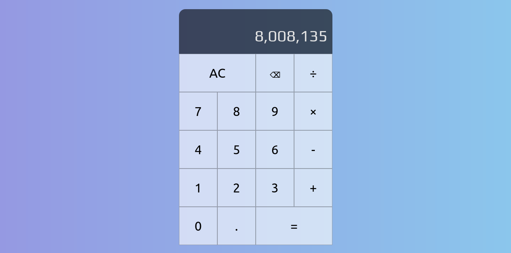

# react-calculator

This calculator has been made using react, following a Web Dev Simplified tutorial on YouTube.

It's basic, but it works.

In the future I'd like to add scientific functionality (sin, cos, tan, sqrt), and a history pane.
